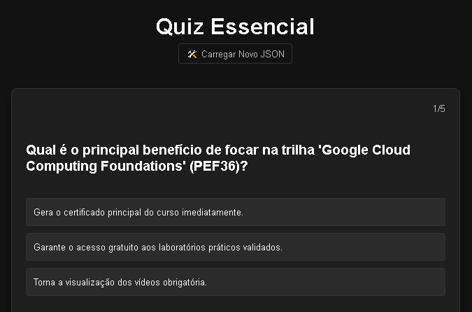

<!--
Tags: Fund, Dev, Skils
Label: ☁️ Quiz Essencial
Description: Aplicação web para criação e fixação de quizzes através da geração de JSON estruturado via IA, com recurso exclusivo de Recomeço Seletivo (Repescagem) em questões erradas.
technical_requirement: JavaScript (Vanilla DOM Manipulation), HTML5, CSS3 (Dark Theme), JSON, Prompts Estruturados.
path_hook: hookfigma.hook8, hookfigma.hook12, hookfigma.hook13
-->
# 🚀 Quiz Essencial: Estudo Estruturado e Fixação Avançada

> ⚙️ **Quiz Essencial** é a sua plataforma de estudo de próxima geração, projetada para transformar o aprendizado passivo em fixação ativa, utilizando prompts de conteúdo altamente estruturados e formatos de revisão otimizados (como o JSON de Quiz ou Roteiros de Ação).

<p align="center">
  
</p>
---


## 💡 O Conceito: Fixação Ativa com Estrutura

Em vez de consumir conteúdo linearmente, o **Quiz Essencial** força o estudante a interagir com informações complexas através de formatos rigorosos, garantindo que o conhecimento seja não apenas compreendido, mas ativamente fixado.

A aplicação se baseia em dois pilares principais:

### 1. **Prompts de Roteiro Estruturado (Formato Markdown)**

Organiza fluxos de estudo complexos, requisitos de certificação ou caminhos de aprendizado em etapas claras, com foco e prioridade definidos.

### 2. **Prompts de Avaliação Estruturada (Formato JSON)**

Gera questões de múltipla escolha de alto nível, com uma justificativa detalhada inclusa na própria estrutura JSON, permitindo revisão imediata e aprofundada.

---

## ✨ Recursos Principais

| Recurso | Descrição | Benefício para o Usuário |
| :--- | :--- | :--- |
| **Quiz Generator** | Cria questões avançadas de múltipla escolha seguindo a estrutura rígida de um array JSON (`pergunta`, `justificativa`, `respostas`). | **Fixação Científica:** Força a revisão ativa e fornece a justificativa no ponto de falha. |
| **Roteiro de Ação** | Transforma metas de estudo (como certificações ou projetos) em fluxos de trabalho visuais e priorizados em Markdown. | **Clareza e Caminho:** Elimina a confusão sobre 'o que estudar em seguida', focando em etapas e prioridades. |
| **Metadados de Contexto** | Usa tags `` para categorizar e filtrar o tipo de prompt. | **Organização:** Facilita a busca e a organização do seu acervo de prompts de estudo. |
| **Nível de Dificuldade** | Permite solicitar conteúdo em diferentes níveis (Básico, Intermediário, **Avançado**), garantindo o desafio adequado. | **Progressão:** Adapta o estudo ao seu nível atual, garantindo que o aprendizado seja sempre relevante. |


## 🛠️ Stack Tecnológico

* **Frontend:** JavaScript (Vanilla DOM Manipulation)
* **Estrutura:** HTML5
* **Estilo:** CSS3 (Totalmente Dark Theme 🌑)
* **Dados:** JSON
* **Geração:** Prompts Estruturados (Engenharia de Prompting Avançada)

---

## ⚙️ Como Usar (Fluxo de Trabalho)

1.  **Clone o Repositório:**
    ```bash
    git clone [https://github.com/fabiuniz/quiz_essencial.git]
    cd quiz-essencial
    ```
2.  **Abra o `index.html`:**
    Simplesmente abra o arquivo `index.html` em seu navegador. Não são necessários servidores ou dependências externas (exceto a conexão com o motor de IA via API).
3.  **Defina o Assunto e o Nível:** Exemplo: Assunto: `GCP`, Nível: `Avançado`.
4.  **Defina a Estrutura de Saída:** Escolha se você precisa de um **Roteiro em Markdown** ou um **Quiz em JSON**.
5.  **Gere o Prompt:** Use o gerador de prompts para criar o conteúdo estruturado.
6.  **Estude e Fixe:** Interaja com o material gerado, utilizando a estrutura rigorosa para uma revisão ativa.

### Exemplo de Saída (Quiz de Fixação Avançada em JSON)

```json
[
  {
    "pergunta": "Qual é a topologia Full-Mesh MÍNIMA para o Dedicated Interconnect com SLA de 99,99%?",
    "justificativa": "Para o 99,99%, são necessárias quatro conexões Dedicated Interconnect...",
    "respostas": [
      {
        "opcao": "...",
        "correto": false
      }
    ]
  }
]
```
## 💡 Melhorias Futuras
- Persistência:
    - Adicionar a função `salvarQuiz(quizJSON)` usando `localStorage.setItem('quiz_atual', JSON.stringify(quizJSON))` após cada interação do usuário.
    - Adicionar a função `carregarQuiz()` usando `JSON.parse(localStorage.getItem('quiz_atual'))` no carregamento da página.
- UX/UI: Implementar a progress bar (manipulação da `width` via JS) e classes CSS de acerto/er

## 🤝 Contribuições

Este é um projeto **Dev** focado em melhorar a eficácia do estudo e fixação de conteúdo complexo. Contribuições, sugestões e relatórios de bugs são bem-vindos!